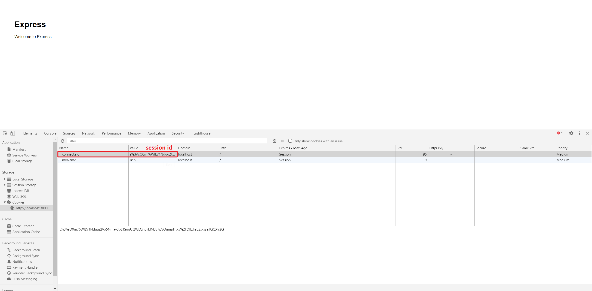

# session
session 是暂存在服务器中的数据，它在浏览器（客户端）的 Cookie 中只保存相应的 session id，这样可以将临时但敏感的数据存储在服务器端，避免了客户端的数据泄露或被操作。

1. 安装 Express [插件 express-session](https://www.npmjs.com/package/express-session)

```bash
npm install express-session --save
```

2. 配置 session

```js
var session = require('express-session');
// ...

app.use(session({
  secret: 'keyboard cat',
  resave: true,   // 浏览器重载时，重新将 session 保留回 session store 中
  saveUninitialized: true,
  // 设定 cookie，即 session 在浏览器中的 session id 存储行为
  cookie: {
    maxAge: 10000,   // session id 号码牌在 10 秒后失效
  }
}))
```

相关参数配置参考[官方文档](https://github.com/expressjs/session#readme)。




:bulb: 存储在 session 中的数据并不能直接通过浏览器的 cookie 查看，仅保留了相应的 seesion id

## 读取
读取在请求 `req` 中包含的 session

```js
// ...
// router
router.get('/', function(req, res, next) {
  // 读取请求中所有 session，可以通过 req.session.key 读取特定的键的 session 值
  console.log(req.session);
  res.render('index', { title: 'Express' });
});
```

## 写入
在服务端向请求 `req` 写入的 session，然后在下一次请求时 `req` 对应的 session id 就会从 node 的 session  `req.session`  中获取之前写入的 session 数据。

:bulb: 但是在浏览器只保存相应的 session id，具体数据依然只保留在服务端的 node 中。

```js
// 写入 session
router.get('/', function(req, res, next) {
  req.session.username = "Tom";
  res.redirect('/');
});
```

```js
// 读取 session
router.get('/', function(req, res, next) {
  res.render('index', {
    userName: req.session.username
   });
});
```