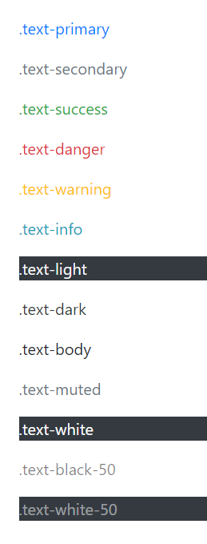
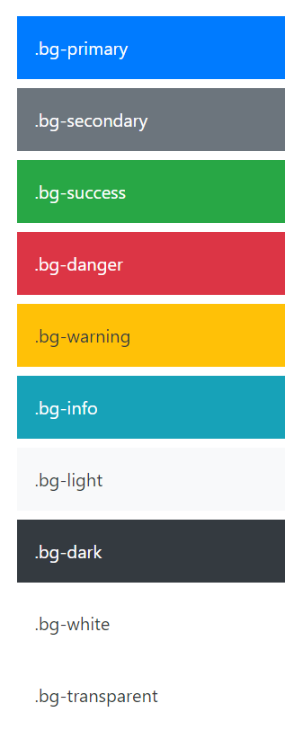

# 基础样式

## 样式重置
引入 Bootstrap 的 CSS 样式表后，会对网页默认样式进行[重置 Reboot](https://getbootstrap.com/docs/4.4/getting-started/introduction/#reboot)，如删除了默认的网页外边距，设置盒子模型的计算方式为 `box-sizing: border-box` 等。

:warning: 由于 Bootstrap 在 Windows 系统下只是设置了字体 `Segoe UI` 则英文字体会显示为非衬线体，而没有对中文字体进行设置，应该手动设置提供默认系统字体，如 `Microsoft JhengHei` 微软正黑体

```css
* {
    font-family: 
    /* 1 */ -apple-system, BlinkMacSystemFont,
    /* 2 */ "Segoe UI",Roboto,
    /* 3 */ "Helvetica Neue", Arial, sans-serif
```

1. 使用系统预设的字体
2. 指定一直系统 UI 字体（在 Windows 系统中添加的 `Microsoft JhengHei` 微软正黑体属于该类别）
3. 备选字体（安全字体）

## 容器
Bootstrap 的容器 `container` 类别有两种

* 第一种是 `class="container-fluid"` 实现动态响应式占比为 100% 宽度 
* 第二种是 `class="container"` 基于 Bootstrap 内置中断点，在不同宽度范围自动使用不同的固定宽度（一般以范围中中断点的下限作为固定宽度）
    * 视窗宽度低于 575px 采用动态 100% 宽度
    * 视窗宽度在 768px ~ 576px 之间，容器采用固定宽度 540px
    * 视窗宽度在 960px ~768px 之间，容器采用固定宽度 720px
    * 视窗宽度大于 1200px，容器采用固定宽度 1140px
    * 视窗宽度在 992px ~ 1200px，容器采用固定宽度 960px

## 尺寸
Bootstrap 提供相应的类属性，以设置元素相对于父元素的大小，有四个梯度分别表示 `25%`、`50%`、`75%`、`100%` 结合前缀 `w` 或 `h` 设置宽或高。

```html
<div class="w-25 p-3" style="background-color: #eee;">Width 25%</div>
```

:bulb: 默认是采用 `w-auto` 和 `h-auto` 块元素的尺寸基于其内容的多少。

:bulb: 可以使用 `mw-100` 或 `mh-100` 以限制元素最大宽度或高度不超过（相对于父元素）100%

:bulb: 可以基于视窗设置元素的宽高，如 `vw-100` 表示元素宽度为 `100vw`

## 语义样式
Bootstrap 提供了语义类型的样式，使样式设置更直观可感，如为元素 `<p>` 添加类 `class="h1"` 即可让段落具有标题一样的外观，但它的并不具有标题的语义。

类似地，Bootstrap 提供了更大、更显著的标题样式，提供了从 `class="display-1"` 至 `class="display-4"` 的可选样式

## 文字样式
通过属性 `.text-justify`、`.text-center`、`.text-right`、`.text-left` 设置文字的不同对齐方式，可以添加中断点关键字，以在特定宽度下实现不同的对齐方式，如 `text-md-left`

文字换行方式可以通过类属性 `.text-nowrap` 或 `.text-wrap` 设置

:bulb: 可以使用 `.text-truncate` 截掉多余的内容以符号  `...` 标记（针对 `display: inline-block` 或 `display: block` 元素，且内容超出元素的宽度限制才会生效）。

通过属性 `.text-lowercase` 、`.text-uppercase`、`.text-capitalize` 将文本转换为相应格式：
* `.text-lowercase` 所有字母为小写
* `.text-uppercase` 所有字母为大写
* `.text-capitalize` 第一个字母大写，其他字母大小写不受影响

字体粗细可以通过标准样式属性 `.font-weight-bold`、`.font-weight-bolder`、`.font-weight-normal`、`.font-weight-light`、`.font-weight-lighter` 进行设置。

字体斜体可以通过样式属性 `.font-italic` 进行设置。取消字体下划线可以设置属性 `.text-decoration-none`

:bulb: Bootstrap 还提供了 `.text-monospace` 将文本设置为 monospace 字体，一般代码文本显式用等宽字体。

## 图片
* `class="img-fluid"` 将图片设置为 `max-width: 100%` 和 `height: auto`
* `class="img-thumbnail"` 将图片设置头缩略图样式，即图片有 1px 白色边框（带圆角）
* `class="rounded"` 为图片添加圆角
* `class="float-left"` 或 `class="float-right"` 实现图片左右排版（当使用浮动对元素进行排版后 :warning: 需要在其容器添加 `class="clearfix"` 清除浮动）
* 图片居中有两种方式
    * 将图片设置为块元素 `class="d-block"` 并设置左右外边距 `class="mx-auto"`
    * 将图片作为文字/行内元素进行设置，为图片添加一个容器并设置水平居中 `class="text-center"`
* Bootstrap 为元素 `<figure>` 和 `<figcaption>` 预设了样式，只需要在 `<figure>` 添加属性 `class="figure"`，在其中的元素 `` 添加属性 `class="figure-img"` 和元素 `<figcaption>` 添加属性 `class="figure-caption">` 即可，默认将描述文字放置在图片左下方，作为图片注释

## 表格
对于表头 `<thead>` 里面的每个表格项 `<th>` 可以添加属性 `scope="col"` 表示该单元格是这一列的标题；类似地如果在表格主体 `<tbody>` 里的每个表格项 `<th>` 则可以添加属性 `scope="row"` 表示该单元格是这一行的标题。

* 为元素 `<table>` 添加 `class="table"` 使用 Bootstrap 默认表格样式，即每一行顶部有边框线；使用 `class="table-bordered"` 为所有单元格加边框线。
* 当表格有很多行较长时，为元素 `<talbe>` 添加 `class="table-striped"` 基于单双列使用不同色彩。
* 为元素 `<table>` 添加 `class="table-hover"` 可以将鼠标悬浮的行显式不同颜色。

在表格外成添加一个容器，并添加属性 `class="table-responsive"` 可以实现**响应式表格**，即在小尺寸会单独为表格添加水平滑块，以保持页面整体适应屏幕。该属性还可以设置中断点以在特定尺寸下才触发响应式表格，如 `class="table-responsive-md"`

表格文本的**垂直对齐方式**可以通过设置相关的样式类属性实现，同样适用于 `inline`、`inline-block`、`inline-table` 元素。

* `.align-baseline` 对齐行基线
* `.align-top` 对齐行顶部
* `.align-middle` 对齐行中部
* `.align-bottom` 对齐行底部
* `.align-text-top` 对齐文本顶部
* `.align-text-bottom` 对齐文本底部

## 间距
Bootstrap 分别用类属性 `m` 和 `p` 表示设置 `margin` 和 `padding` 样式，而方向分别用相应字母缩写表示（缺省就表示四周都设置），通过数字 0~5 表示标准化的距离大小，以默认字体大小（16px）作为基本距离，依次递增 0.25 倍，如 `mt-3`，此外距离还可以使用关键字 `auto` 根据容器可用空间实现自动分配。

* `t` 顶部
* `b` 底部
* `l` 左侧
* `r` 右侧
* `x` 左右两侧
* `y` 上下两侧

:bulb: 使用属性 `.mx-auto` 可以实现块元素居中；另一小技巧是**在 Flexbox 布局中**，只为其中一个 flex 项目设置单侧外边距为 `auto` 这样就可以将相应一侧的元素「推开」，巧妙地实现 flex 项目左右布局的样式，如 `ml-auto`。

:bulb: Bootstrap 从 4.2 版本开始提供了**负**外边距 `margin`（`padding` 不可设置负值），标准化的大小与正值相对应也是 0~5，只需要添加前缀 `n` 表示 negative，如 `.mt-m1` 为元素添加 `margin-top: -0.25rem`。一般用在网格系统，当我们在 `.col` 列元素自定义间隔 Gutter 时，需要 `.row` 行元素上添加相应的负外边距以「抵消」网格两侧多出的 `padding` 以保证每一行宽度一致。

```html
<!-- 这是一个在（md）中断点及以上自定义 Bootstrap 网格系统的范例。我们用 .px-md-5 增加了 .col 内距，然后在父元素 .row 上用 .mx-md-n5 来抵消 -->

<div class="row mx-md-n5">
  <div class="col py-3 px-md-5 border bg-light">Custom column padding</div>
  <div class="col py-3 px-md-5 border bg-light">Custom column padding</div>
</div>
```

## 边框
使用 `.border` 可以为元素添加边框，默认是浅灰色。可以添加后缀 `border-top`、`border-right`、`border-bottom`、`border-left` 只在特定一边添加边框。

使用 `.border-0` 可以去除元素的边框，可以添加后缀，如 `border-top-0`，去除特定一边的边框。

Bootstrap 为内置多种边框颜色样式，为元素相应的类即可（部分类名称具有语义以标准化颜色在设计体系中的作用）


```html
<span class="border border-primary"></span>
<span class="border border-secondary"></span>
<span class="border border-success"></span>
<span class="border border-danger"></span>
<span class="border border-warning"></span>
<span class="border border-info"></span>
<span class="border border-light"></span>
<span class="border border-dark"></span>
<span class="border border-white"></span>
```

使用 `.rounded` 将元素的边框变为圆角，可以添加方向后缀，如  `rounded-top`，只将顶部两侧的角变为圆角；还可以添加后缀 `rounded-circle` 或 `rounded-pill` 让元素变成圆形或药丸按钮形状。

## 颜色
Bootstrap 为文字、链接、背景提供了多种预设颜色，通过 `.text-{颜色关键字}` 或 `.bg-{颜色关键字}` 来使用。



```html
<p class="text-primary">.text-primary</p>
<p class="text-secondary">.text-secondary</p>
<p class="text-success">.text-success</p>
<p class="text-danger">.text-danger</p>
<p class="text-warning">.text-warning</p>
<p class="text-info">.text-info</p>
<p class="text-light bg-dark">.text-light</p>
<p class="text-dark">.text-dark</p>
<p class="text-body">.text-body</p>
<p class="text-muted">.text-muted</p>
<p class="text-white bg-dark">.text-white</p>
<p class="text-black-50">.text-black-50</p>
<p class="text-white-50 bg-dark">.text-white-50</p>
```

:bulb: 当为链接文字设置颜色时，Bootstrap 会默认添加 `hover` 颜色加深的效果。


```html
<div class="p-3 mb-2 bg-primary text-white">.bg-primary</div>
<div class="p-3 mb-2 bg-secondary text-white">.bg-secondary</div>
<div class="p-3 mb-2 bg-success text-white">.bg-success</div>
<div class="p-3 mb-2 bg-danger text-white">.bg-danger</div>
<div class="p-3 mb-2 bg-warning text-dark">.bg-warning</div>
<div class="p-3 mb-2 bg-info text-white">.bg-info</div>
<div class="p-3 mb-2 bg-light text-dark">.bg-light</div>
<div class="p-3 mb-2 bg-dark text-white">.bg-dark</div>
<div class="p-3 mb-2 bg-white text-dark">.bg-white</div>
<div class="p-3 mb-2 bg-transparent text-dark">.bg-transparent</div>
```

:bulb: 为了让文字清晰可见，推荐在深色/有颜色的背景配合使用白色文字 `.text-white`；只在白色/浅色背景 `.bg-right` 或 `.bg-light` 使用文字的其他颜色。

## diplay
Bootstrap 提供不同的 display 属性，常用的三种属性

* `.d-block` 块元素
* `.d-inline` 行内元素
* `.d-inline-block` 行内元素，但可以调节高度等

:bulb: 还可以插入中断点关键字，如 `d-lg-inline` 在大视窗下才显示为行内元素

## visibility
Bootstrap 为元素可视提供了两种样式属性 `.invisible` 和 `.visible`，当为元素添加了 `.invisible` 它会被隐藏，当元素的空间占位依然存在。

:bulb: 与设置 `.d-none` 区别在于通过设置 `display`  让元素隐藏，会同时将元素的占位也隐藏。

## 内嵌
Bootstrap 为内嵌元素 `<iframe>`、`<embed>`、`<video>` 等，添加了属性 `.embed-responsive` 以实现响应式，同时允许设置嵌入元素的宽高比例，如 `.embed-responsive-21by9` 将元素限制在宽高比为 21：9 比例进行缩放。

```html
<div class="embed-responsive embed-responsive-16by9">
  <iframe class="embed-responsive-item" src="https://www.youtube.com/embed/zpOULjyy-n8?rel=0" allowfullscreen></iframe>
</div>
```

:bulb: 并非所有媒体/视频都支持嵌入，嵌入 `<iframe>` 源码应该从各大流播网站平台获取。

## 屏幕阅读器
为元素添加 `.sr-only` 可以将其对所有设备进行隐藏，除了**屏幕阅读器**才可读。將`.sr-only` 与 `.sr-only-focusable` 相结合，以便在元素被 `focused` 时再次显示该元素（如通过快捷键 `Tab` 切换展示）。也可以用作 Sass mixins。

```html
<a class="sr-only sr-only-focusable" href="#content">Skip to main content</a>
Copy
```

```css
// Usage as a mixin
.skip-navigation {
  @include sr-only;
  @include sr-only-focusable;
}
```

