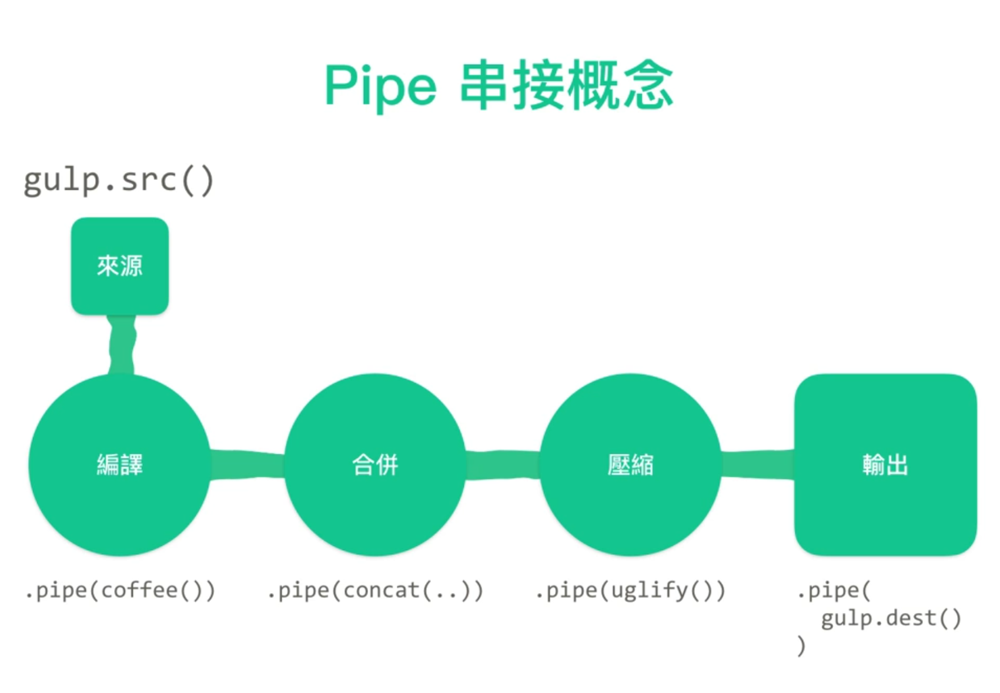

# 简介
参考：
* [https://gulpjs.com/](gulp.js) | [中文网站](https://www.gulpjs.com.cn/)
* [使用 gulp 進行網頁前端自動化](https://www.udemy.com/course/gulp-learning/)

[Gulp](https://gulpjs.com/) 是由[Eric Schoffstall](https://en.wikipedia.org/wiki/Gulp.js#cite_note-:0-4) 开发的一个 node 模块，利用 JavaScript 脚本编写一些列预定的任务，（类似于流水通过管道 pipelines）将多个操作串联依次执行可以实现自动的工作流。

在 Gulp 社区中已经有很多开发者针对不同的（前端）任务将常用的工作流打包成[插件](https://gulpjs.com/plugins)，我们可以通过安装相应的插件，利用多个开发者的预设工作流快速打造属于自己的高效工作流，可以从日常各种繁琐重复的工作中解脱出来。



## 基本语法
Gulp 脚本 `gulpfile.js` 是由各种任务 task 构成的

```js
gulp.task('task_name', function() {
    // input file source
    gulp.src('source_files_path')
    //  multiple pipes
    .pipe($.plumber())
    .pipe($.jade({
      // locals: YOUR_LOCALS
      pretty: true
    }))
    // file output
    .pipe(gulp.dest('output_files_path'))
})
```
